# Life Organisation System (LOS) - Target Operating Model (TOM)

This document provides a comprehensive overview of the active file taxonomy, from L1 (Domain) down to L4 (Context).

## Overview L1-L4

### 01 00 00 Private
- **01 01 00 Personal Admin**
  - 01 01 01 Task Management
    - Productivity Frameworks
    - The System (TS)
  - 01 01 02 Contracts
    - Signature
- **01 02 00 Health**
  - 01 02 01 Physical Health
    - 2026 Pregnancy
    - Medical Appointments & Tests
- **01 04 00 Finances**
  - 01 04 01 Purchase
    - Instructions
    - Passes & Tickets
    - Receipts
  - 01 04 02 House
    - SW1V 4QE
- **01 05 00 Other**
  - 01 05 01 Projects
    - 202604-202605 Staycation
    - 20260509 LFC-CFC
    - 20260510-20260514 Lisbon
    - 202606 P&E
    - 202606 Passport
    - 202608 M&N
    - 2027 Wedding
    - AI
    - Clothes
    - Data Analysis & Software Development
    - Cooking
    - Declutter
    - Upgrade Office
  - 01 05 02 Relationships
    - Alexander & Gabriel
    - CMA
    - Mamma & Pappa
    - Niklas Johansson
  - 01 05 03 Collections
    - History
    - Liverpool FC
    - Memories
    - Newsletters
    - Star Wars
    - Useful/Helpful
### 01 00 00 Unknown
- **01 04 00 Private**
  - 01 04 00 Finances
    - Banking
    - Budgeting & Planning
    - Crypto
    - Insurance
    - Investing
    - Payslips
    - Pension
    - Revolut Equity
    - Services & Subscriptions
    - Tax
### 02 00 00 Unknown
- **02 02 00 Work**
  - 02 02 00 Career Management
    - 202603 Airwallex
    - 202603 OLIX
    - 202604 Deel
    - 202607 Humanoid
    - CVs & Cover Letters
    - Grades & Certificates
- **02 03 00 Work**
  - 02 03 00 Collections
    - Newsletters
### 02 00 00 Work
- **02 01 00 Employment**
  - 02 01 01 Playmetech
    - 01 Playmetech Admin
    - 02 Team & Operations
    - 03 Professional Growth
    - 04 Finances
    - 05 Projects

## Directory Visualisation

```mermaid
graph TD
    Root[My Drive]
    Root --> N1["01 00 00 Private"]
    N1 --> N2["01 01 00 Personal Admin"]
    N2 --> N3["01 01 01 Task Management"]
    N3 --> N4["Productivity Frameworks"]
    N3 --> N5["The System (TS)"]
    N2 --> N6["01 01 02 Contracts"]
    N6 --> N7["Signature"]
    N1 --> N8["01 02 00 Health"]
    N8 --> N9["01 02 01 Physical Health"]
    N9 --> N10["2026 Pregnancy"]
    N9 --> N11["Medical Appointments & Tests"]
    N1 --> N12["01 04 00 Finances"]
    N12 --> N13["01 04 01 Purchase"]
    N13 --> N14["Instructions"]
    N13 --> N15["Passes & Tickets"]
    N13 --> N16["Receipts"]
    N12 --> N17["01 04 02 House"]
    N17 --> N18["SW1V 4QE"]
    N1 --> N19["01 05 00 Other"]
    N19 --> N20["01 05 01 Projects"]
    N20 --> N21["202604-202605 Staycation"]
    N20 --> N22["20260509 LFC-CFC"]
    N20 --> N23["20260510-20260514 Lisbon"]
    N20 --> N24["202606 P&E"]
    N20 --> N25["202606 Passport"]
    N20 --> N26["202608 M&N"]
    N20 --> N27["2027 Wedding"]
    N20 --> N28["AI"]
    N20 --> N29["Clothes"]
    N20 --> N30["Data Analysis & Software Development"]
    N20 --> N31["Cooking"]
    N20 --> N32["Declutter"]
    N20 --> N33["Upgrade Office"]
    N19 --> N34["01 05 02 Relationships"]
    N34 --> N35["Alexander & Gabriel"]
    N34 --> N36["CMA"]
    N34 --> N37["Mamma & Pappa"]
    N34 --> N38["Niklas Johansson"]
    N19 --> N39["01 05 03 Collections"]
    N39 --> N40["History"]
    N39 --> N41["Liverpool FC"]
    N39 --> N42["Memories"]
    N39 --> N43["Newsletters"]
    N39 --> N44["Star Wars"]
    N39 --> N45["Useful/Helpful"]
    Root --> N46["01 00 00 Unknown"]
    N46 --> N47["01 04 00 Private"]
    N47 --> N48["01 04 00 Finances"]
    N48 --> N49["Banking"]
    N48 --> N50["Budgeting & Planning"]
    N48 --> N51["Crypto"]
    N48 --> N52["Insurance"]
    N48 --> N53["Investing"]
    N48 --> N54["Payslips"]
    N48 --> N55["Pension"]
    N48 --> N56["Revolut Equity"]
    N48 --> N57["Services & Subscriptions"]
    N48 --> N58["Tax"]
    Root --> N59["02 00 00 Unknown"]
    N59 --> N60["02 02 00 Work"]
    N60 --> N61["02 02 00 Career Management"]
    N61 --> N62["202603 Airwallex"]
    N61 --> N63["202603 OLIX"]
    N61 --> N64["202604 Deel"]
    N61 --> N64a["202607 Humanoid"]
    N61 --> N65["CVs & Cover Letters"]
    N61 --> N66["Grades & Certificates"]
    N59 --> N67["02 03 00 Work"]
    N67 --> N68["02 03 00 Collections"]
    N68 --> N69["Newsletters"]
    Root --> N70["02 00 00 Work"]
    N70 --> N71["02 01 00 Employment"]
    N71 --> N72["02 01 01 Playmetech"]
    N72 --> N73["01 Playmetech Admin"]
    N72 --> N74["02 Team & Operations"]
    N72 --> N75["03 Professional Growth"]
    N72 --> N76["04 Finances"]
    N72 --> N77["05 Projects"]
```

